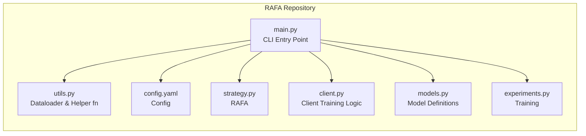

# RAFA: Robust Adaptive Federated Aggregation

The code in this repository implements **RAFA (Robust Adaptive Federated Averaging)**, a client selection and aggregation strategy aimed at non-IID data.

---



- **`main.py`**: Orchestrates experiments.  
- **`config.yaml`**: Holds default hyperparameters.  
- **`utils.py`**: Utilities for dataloading, config loading, seeding, argument overrides etc...  
- **`strategy.py`**: Implementations of RAFA and other federation strategies.  
- **`client.py`**: Local training, fit/evaluate methods for each simulated client.  
- **`models.py`**: Model definitions.  
- **`experiments.py`**: Train & Test code

## 1. Usage Instructions

### 1.1 Installation

1. Install required Python packages:
   ```bash
   pip install -r requirements.txt
   ```
   or manually:
   ```bash
   pip install flwr torch torchvision pyyaml numpy
   ```
2. Ensure your environment has Python 3.7+.

### 1.2 Running Experiments

1. **Default Experiment (uses `config.yaml`):**
   ```bash
   python main.py
   ```
2. **CLI Overrides:**
   ```bash
   python main.py --dataset mnist --strategy RAFA --nclients 100 --rounds 30
   ```
   Here, any provided argument (e.g., `--dataset`, `--strategy`, `--nclients`, `--partition`, etc.) overwrites the corresponding field in `config.yaml`.

### 1.3 Results

By default, logs and metrics (accuracy, losses, etc.) are saved in the file specified by `result_path` in `config.yaml` (e.g., `results_global.pkl`). Update this path if desired.

---

## 2. RAFA Strategy

### 2.1 Core Idea

RAFA enhances learning stability under highly non-IID conditions. It combines:

- **Adaptive client selection**: selecting clients based on a *joint contribution score*,
- **Weighted aggregation**: where each local update is scaled by that score,
- **Recency weighting**: emphasizing recent valuable updates,
- **Dynamic weighting** of key factors such as historical contribution, update significance, and update informativeness.

### 2.2 Mathematical Formulation

At round $t$, a subset $S_t$ of clients is selected. Each client $i \in S_t$ provides a local update $\Delta w_i^t$. The global update $\Delta w_g^t$ is a weighted sum:

$$
\Delta w_g^t \;=\; \sum_{i \in S_t}\, \biggl(\frac{J_i^t}{\sum_{j \in S_t} J_j^t}\biggr)\,\Delta w_i^t
$$

where $J_i^t$ is the **joint contribution score** of client $i$. That score is defined as:

$$
J_i = \alpha H_i \;+\; \beta S_i \;+\; \gamma I_i,
$$

with:
- $H_i$: historical contribution,
- $S_i$: significance (e.g. $L^2$-norm of local update),
- $I_i$: informativeness (cosine similarity to global model),
- $\alpha, \beta, \gamma$: adaptive weights automatically updated each round to prioritize the component(s) that yield higher performance gains.

### 2.3 Client Selection

RAFA’s client selection step:
1. Ranks clients by $J_i$ from previous rounds,
2. Retains the top fraction (e.g., half) of last round’s selected clients,
3. Randomly picks remaining clients to encourage exploration.

### 2.4 Adaptive Weights

The weights $\alpha, \beta, \gamma$ update each round based on approximate gradient signals from performance gains. After bounding them by a minimum threshold, they are normalized to sum to 1.

---


